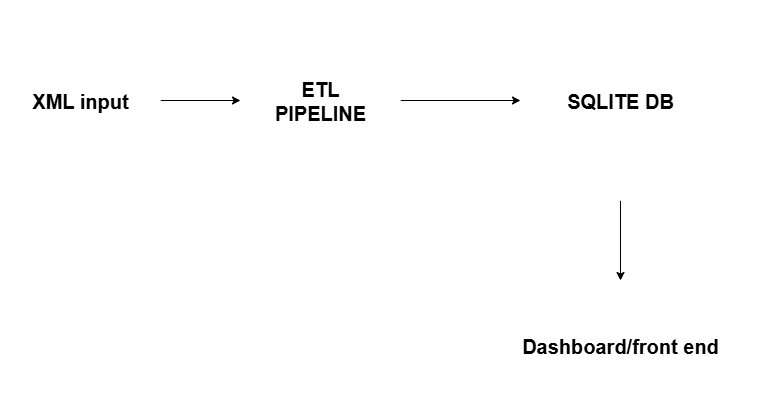

# MoMo SMS Data Processor

## Team Information
**Team Name:** CodeCrafters  
**Project:** Enterprise-level Fullstack MoMo SMS Data Processing Application

### Team Members
- **Elvis Kenny Nsengimana Ishema**
- **Lydivine Umutesi Munyampundu**
- **Seth Iradukunda**

## Project Description
This enterprise-level fullstack application processes Mobile Money (MoMo) SMS data in XML format, cleans and categorizes the data, stores it in a relational database, and provides a frontend interface for data analysis and visualization.

### Key Features
- XML data parsing and processing
- Data cleaning and normalization
- Transaction categorization
- SQLite database storage
- Interactive web dashboard
- RESTful API (optional)
- Comprehensive logging and error handling

## System Architecture


## Scrum Board – CodeCrafters
**To Do**
Complete ETL pipeline (parse → clean → categorize → load → export JSON)
Implement RESTful API endpoints (/transactions, /analytics)
Write advanced unit + integration tests
Performance optimization for ETL & database
 
**In Progress**
-FastAPI development (Elvis)
-Frontend dashboard enhancements (Lydivine)
-DevOps setup & CI/CD (Seth)

**Done**

-Repository setup
-Initial project structure scaffold
-Basic XML parsing prototype

## Project Structure
```
.
├── README.md                         # Setup, run, overview
├── .env.example                      # DATABASE_URL or path to SQLite
├── requirements.txt                  # lxml/ElementTree, dateutil, (FastAPI optional)
├── index.html                        # Dashboard entry (static)
├── web/
│   ├── styles.css                    # Dashboard styling
│   ├── chart_handler.js              # Fetch + render charts/tables
│   └── assets/                       # Images/icons (optional)
├── data/
│   ├── raw/                          # Provided XML input (git-ignored)
│   │   └── momo.xml
│   ├── processed/                    # Cleaned/derived outputs for frontend
│   │   └── dashboard.json            # Aggregates the dashboard reads
│   ├── db.sqlite3                    # SQLite DB file
│   └── logs/
│       ├── etl.log                   # Structured ETL logs
│       └── dead_letter/              # Unparsed/ignored XML snippets
├── etl/
│   ├── __init__.py
│   ├── config.py                     # File paths, thresholds, categories
│   ├── parse_xml.py                  # XML parsing (ElementTree/lxml)
│   ├── clean_normalize.py            # Amounts, dates, phone normalization
│   ├── categorize.py                 # Simple rules for transaction types
│   ├── load_db.py                    # Create tables + upsert to SQLite
│   └── run.py                        # CLI: parse -> clean -> categorize -> load -> export JSON
├── api/                              # Optional (bonus)
│   ├── __init__.py
│   ├── app.py                        # Minimal FastAPI with /transactions, /analytics
│   ├── db.py                         # SQLite connection helpers
│   └── schemas.py                    # Pydantic response models
├── scripts/
│   ├── run_etl.sh                    # python etl/run.py --xml data/raw/momo.xml
│   ├── export_json.sh                # Rebuild data/processed/dashboard.json
│   └── serve_frontend.sh             # python -m http.server 8000 (or Flask static)
└── tests/
    ├── test_parse_xml.py             # Small unit tests
    ├── test_clean_normalize.py
    └── test_categorize.py
```

## Setup and Installation

### Prerequisites
- Python 3.8+
- Git
- Web browser

## Development Workflow

1. **Feature Development**: Create feature branches from `main`
2. **Code Review**: Submit pull requests for code review
3. **Testing**: Ensure all tests pass before merging
4. **Documentation**: Update documentation for new features
